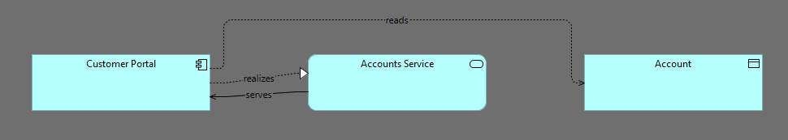
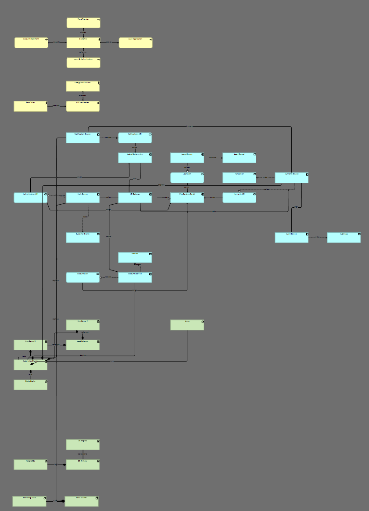
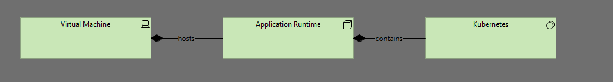

# ArchiMate MCP Server

A deterministic ArchiMate 3.1 modeling engine with optional LLM/MCP integration for generating architecture diagrams from plain text.

---

## Overview

This project provides a structured, testable, and export-ready engine for creating ArchiMate models programmatically.

It supports:

* Model validation (ArchiMate rules)
* Automatic view generation (layout engine)
* Export to ArchiMate Open Exchange Format (XML)
* Integration with LLM agents via MCP skills


Unlike diagramming tools, this project focuses on:

- deterministic model generation
- validation-first architecture modeling
- LLM-assisted but engine-controlled workflows
---

## Features

* Deterministic model generation
* Built-in validation engine
* Auto-layout for diagrams
* XML export compatible with Archi
* Testable and CI-ready
* Extensible via patch/command model

---

## Installation

```bash
git clone https://github.com/zthanos/archimate-mcp-server
cd archimate-mcp-server
uv sync
```

---

## ⚡ 30-Second Quick Start

```bash
uv run server.py
```

Example input:

```text
Customer uses a portal that calls an account service
```

The system will:

1. Extract ArchiMate elements
2. Validate relationships
3. Generate diagram views
4. Export XML

---

### End-to-End Example

Input:
"Customer uses a portal that calls an account service"

Output:
- 3 elements
- 2 relationships
- Application + Integration views
- Exported XML (Archi-compatible)

## Usage

CLI export example:

```bash
uv run archimate-mcp-cli export src/archimate_mcp/examples/sample_model.json --output out/model.xml
```

Import into Archi:

```
File → Import → Open Exchange File
```

---

## 🧪 Example Output

The following diagrams are generated automatically from the sample model.

### Application View



### Integration View



### Technology View



---

## Skills (MCP / Copilot Integration)

This repository includes optional "skills" for LLM agent integration.

Location:

```
skills/
```

These are NOT part of the core engine.

### Responsibilities

Skills:

* Define prompts
* Orchestrate workflows
* Call engine functions

Core engine (`src/archimate_mcp`):

* Deterministic
* Testable
* LLM-agnostic

Example skill usage:

- Input: plain text architecture description
- Output: validated ArchiMate model + XML

---

## Project Structure

```
src/archimate_mcp/   Core engine
skills/              LLM/MCP layer
tests/               Test suite
```

---

## Development

Run tests:

```bash
uv run pytest -q
```

---

## Testing Strategy

* Schema validation (Pydantic)
* Relationship validation
* Layout and routing checks
* Export validation
* End-to-end workflow tests

---

## Roadmap

- [x] Core modeling engine
- [x] Validation layer
- [x] Layout engine
- [x] XML export
- [x] Basic MCP skills

- [ ] Patch/command system (in progress)
- [ ] Incremental model updates
- [ ] Advanced routing (collision-free)
- [ ] Multi-view consistency
- [ ] API / service layer

## Contributing

* Use feature branches
* Open PRs for changes
* Ensure tests pass

---

## License

MIT License
